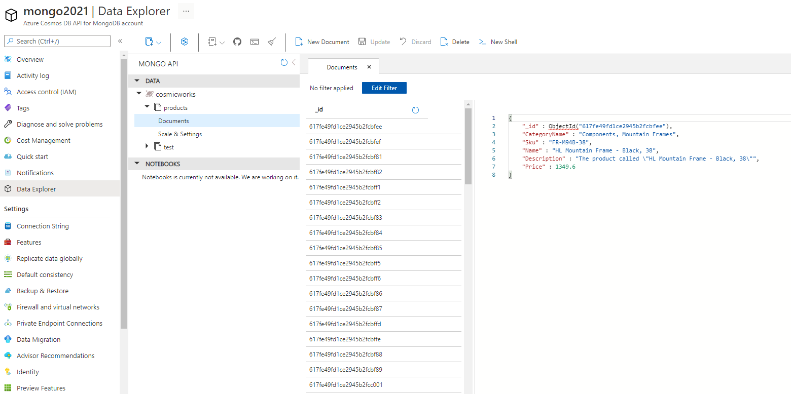
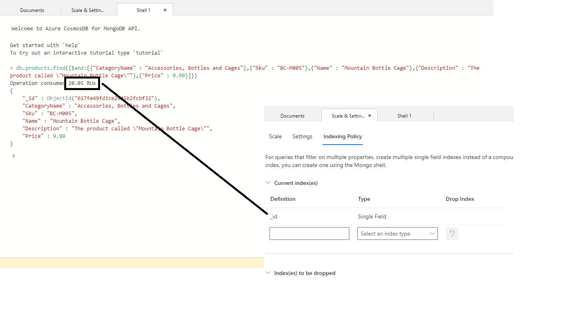
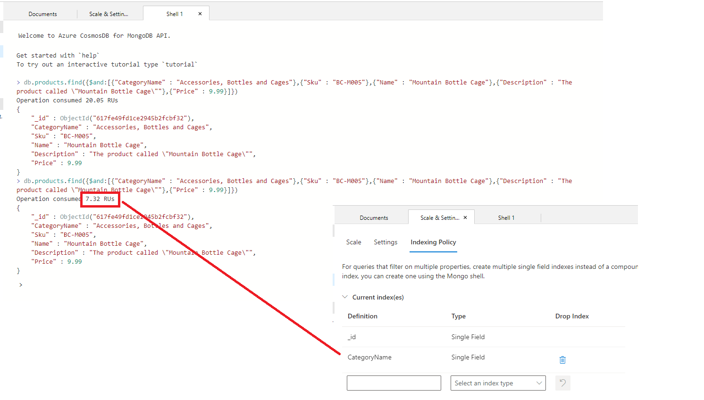
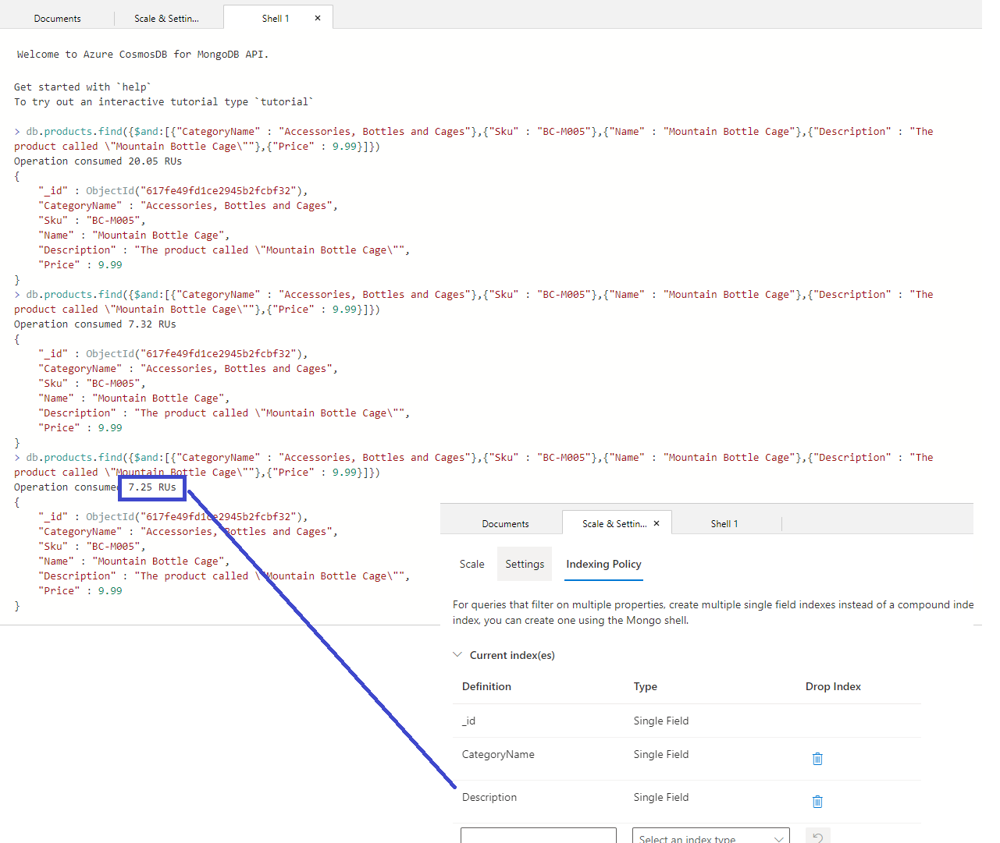
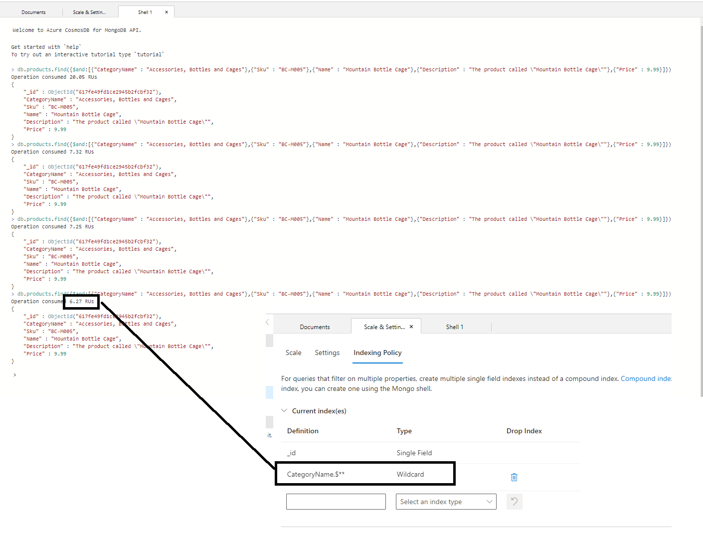
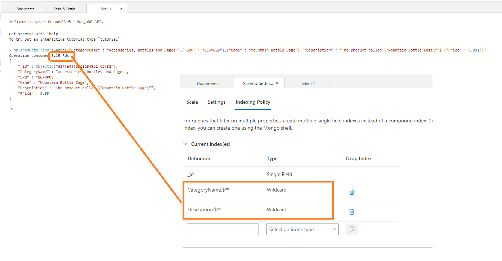

# Optimizing Cosmos DB API for MongoDB Query RU Consumption
Optimizing Azure Cosmos DB API for MongoDB Query RU Consumption by virtue of Indexing Changes using the Azure portal.


The Azure Cosmos DB API for MongoDB makes it easy to use Microsoft's premier NoSQL database, Azure Cosmos DB as if it were a MongoDB database. You can leverage your MongoDB experience and continue to use your favorite MongoDB drivers, SDKs, and tools by pointing your application to the API for MongoDB account's connection string. Visit [here](https://docs.microsoft.com/en-us/azure/cosmos-db/mongodb/mongodb-introduction) for getting started with Azure Cosmos DB API for MongoDB.

**How do I find the request unit charge for operations executed in Azure Cosmos DB API for MongoDB**

You can use the [Azure portal](https://docs.microsoft.com/en-us/azure/cosmos-db/mongodb/find-request-unit-charge-mongodb#use-the-azure-portal), [MongoDB .NET driver](https://docs.microsoft.com/en-us/azure/cosmos-db/mongodb/find-request-unit-charge-mongodb#use-the-mongodb-net-driver), [MongoDB Java driver](https://docs.microsoft.com/en-us/azure/cosmos-db/mongodb/find-request-unit-charge-mongodb#use-the-mongodb-java-driver) & [MongoDB Node.js driver](https://docs.microsoft.com/en-us/azure/cosmos-db/mongodb/find-request-unit-charge-mongodb#use-the-mongodb-nodejs-driver).

**If my Query is using too many RUs, where do I look for optimizing my RU Consumption**
There are a couple of places you should look at as documented here.

The starting place is $explain command.
```
db.coll.find({foodGroup: "Baby Foods"}).explain({"executionStatistics": true })
```

If your Query's RU is too high, then you should investigate further to understand whether you've correctly set Indexes for the Collection. As explained here in this document.

**Example process:**
- *Step1:* Use this [QuickStart](https://docs.microsoft.com/en-us/azure/cosmos-db/mongodb/create-mongodb-dotnet) to build a .NET Web API using Azure Cosmos DB's API for MongoDB. Then load the sample data using [mongoimport](https://docs.mongodb.com/database-tools/mongoimport/#mongodb-binary-bin.mongoimport), a CLI tool that easily imports small amounts of JSON, CSV, or TSV data.
```
mongoimport --host <HOST>:<PORT> -u <USERNAME> -p <PASSWORD> --db cosmicworks --collection products --ssl --jsonArray --writeConcern="{w:0}" --file Data/products.json
```

- *Step2:* After successfully uploading the data, you visit Data Explorer and check your documents have been successfully loaded. Your screen should look like as shown below. I have opened the 1st document and it has the attributes: CategoryName, Sku, Name, Description & Price.



- *Step3:* I wish to perform a logical AND operation on an array of one or more expressions (<expression1>, <expression2>, and so on). The query, if correctly executed, should select the documents that satisfy all the expressions. Click on the ">_ New Shell" button which opens up a Mongo Shell.
```
db.products.find({$and:[{"CategoryName" : "Accessories, Bottles and Cages"},{"Sku" : "BC-M005"},{"Name" : "Mountain Bottle Cage"},{"Description" : "The product called \"Mountain Bottle Cage\""},{"Price" : 9.99}]})
```
This generates the output of 1 document which costs: 20.05 RUs. If we check the 'Indexing Policy' it is set to a [b]Single Field[/b] value; i.e. _id = Single Field.


- *Step4:* We wish to optimize the query RU consumption. Visit 'Indexing Policy' and set CategoryName = SingleField. This creates an Index on the named field.
This generates the output of 1 document which costs: 7.32 RUs.

  
- *Step5:* We wish to optimize further for RU consumption. Visit 'Indexing Policy' and add Description = SingleField. This creates an Index on the named field.
This generates the output of 1 document which costs: 7.25 RUs.

  
- *Step6:* We wish to optimize further for RU consumption. Visit 'Indexing Policy' and delete both the 2 'Singe Field' indexes and add a new 'Wildcard' Index to the container, i.e. CategoryName.$**. This creates a Wildcard Index on the CategoryName attribute.
This generates the output of 1 document which costs: 6.27 RUs.

  
- *Step7*: Can this be further RU Optimized? Visit 'Indexing Policy' and add a new 'Wildcard' Index to the container, i.e. Description.$**. This creates a Wildcard Index on the Description attribute.
This generates the output of 1 document which costs: 3.15 RUs.

  
In short, we have been able to successfully bring down Query RU consumption from 20 RUs to 3 RUs, just by tweaking Single Field & Wildcard Indexes.
  
**Types of Indexes**:
Azure Cosmos DB's API for MongoDB supports three types of Indexes:
  1. Single Field Indexes, supported using Azure portal.
  2. Wildcard Indexes, supported using Azure portal.
  3. Compound Indexes, currently not supported creation using Azure portal. You shall need to build either using .NET / Java SDK or your favorite Mongo tool.

**Summary**:
 
